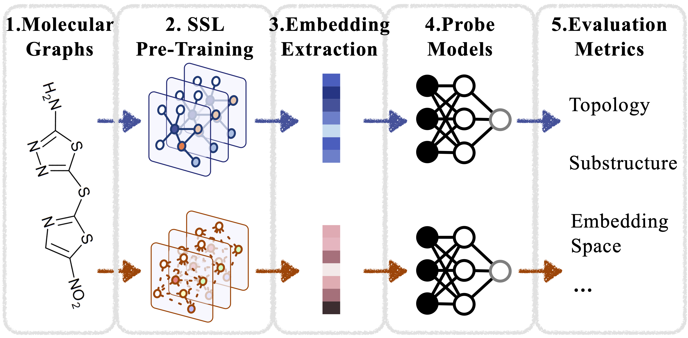

## MolGraphEval

This repository is the official implementation of paper: "**Evaluating Self-supervised Learning for Molecular Graph Embeddings**”, NeurIPS 2023, Datasets and Benchmarks Track.



### Citation
```bibtex
@inproceedings{GraphEval,
  title = {Evaluating Self-supervised Learning for Molecular Graph Embeddings},
  author = {Hanchen Wang* and Jean Kaddour* and Shengchao Liu and Jian Tang and Joan Lasenby and Qi Liu},
  booktitle = {NeurIPS 2023, Datasets and Benchmarks Track},
  year = 2023
}
```

### Usage
We include scripts for pre-training, probing and fine-tuning for GraphSSL on molecules, see <a href="script/">script</a> folder. We use conda to set up the environment:
```bash
conda env create -f env.yaml
```